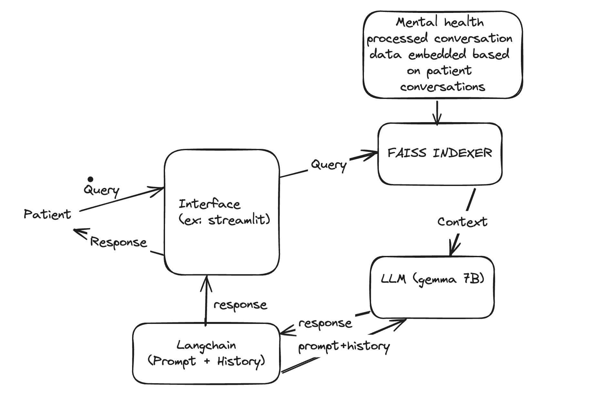

# Conversational Therapist Assistant

This project is a conversational therapist assistant built using langchain, huggingface and FAISS. It provides a simple interface for users to engage in a conversation with the assistant.

## Features

- Users can interact with the assistant by typing messages.
- The assistant provides responses based on the conversation history.
- Conversation history is saved to a text file for each user session.

## Architecture



## Installation

```bash
pip install -r requirements.txt
```

## Usage

 streamlit problem is fixed it is working as expected. Below command will run the streamlit app. When you finished enter exit in the chat. your history will be saved to a txt file with your user id as name in the data/output folder.

## Run Streamlit

```bash
 streamlit run src/streamlit.py
```
## Data

the data used in this app is from following link
https://huggingface.co/datasets/vibhorag101/phr_mental_therapy_dataset?row=9

The above data seems to be more suitable for the task, data is processed and stored in a seperate file.


## File Structure

- `src/streamlit.py`: Main script containing the Streamlit app.
- `data/`: Directory containing conversation data and embeddings.
- `utils/data_preparation.py`: script for processing data
- `utils/text_encoder.py`: script for generating embeddings for text
- `src/data_utils.py`: Module for loading and processing data.
- `src/embeddings.py`: Module for loading embeddings.
- `src/dialog_chain.py`: Module for creating and processing the dialogue chain.
- `src/main.py`: main script of the chatbot
- `src/evaluation.py`: evaluation script consist of faithfulness, correctness and MRR metrics
- `README.md`: This file.

## to-do

- Enchance retriever output
- make the llm response more like human , for the moment the bot is responding , but not in a conversational manner. (some prompt finetuning needed)
- History aware response needed.
- Run evaluation
